# Module Dependency Graph
*Generated: 2025-08-25*

## Core Architecture Visualization

```mermaid
graph TD
    %% Entry Point
    shotbot[shotbot.py<br/>Entry Point]
    
    %% Main Window
    main_window[main_window.py<br/>1,755 lines<br/>NEEDS REFACTOR]
    
    %% Core Data Models
    shot_model[shot_model.py<br/>543 lines]
    threede_model[threede_scene_model.py]
    prev_shots_model[previous_shots_model.py]
    
    %% Process Management (REFACTORED)
    process_pool[process_pool_manager.py<br/>668 lines<br/>IMPROVED ✓]
    bash_session[persistent_bash_session.py<br/>830 lines<br/>EXTRACTED ✓]
    
    %% Launcher System
    launcher_mgr[launcher_manager.py<br/>2,003 lines<br/>NEEDS REFACTOR]
    launcher_dlg[launcher_dialog.py]
    launcher_cfg[launcher_config.py]
    cmd_launcher[command_launcher.py]
    
    %% Cache System (Already Refactored)
    cache_mgr[cache_manager.py<br/>572 lines<br/>REFACTORED ✓]
    cache_storage[cache/storage_backend.py]
    cache_memory[cache/memory_manager.py]
    cache_thumb[cache/thumbnail_processor.py]
    cache_fail[cache/failure_tracker.py]
    
    %% UI Components
    shot_grid[shot_grid.py]
    prev_grid[previous_shots_grid.py]
    threede_grid[threede_shot_grid.py]
    shot_info[shot_info_panel.py]
    
    %% Workers/Finders
    threede_finder[threede_scene_finder_optimized.py]
    threede_worker[threede_scene_worker.py]
    prev_finder[previous_shots_finder.py]
    prev_worker[previous_shots_worker.py]
    raw_finder[raw_plate_finder.py]
    
    %% Utilities
    utils[utils.py]
    config[config.py]
    
    %% External Dependencies
    pyside6[PySide6<br/>QtCore/QtWidgets/QtGui]
    
    %% Dependencies
    shotbot --> main_window
    
    main_window --> shot_model
    main_window --> launcher_mgr
    main_window --> launcher_dlg
    main_window --> prev_grid
    main_window --> shot_grid
    main_window --> threede_grid
    main_window --> shot_info
    main_window --> cache_mgr
    main_window --> cmd_launcher
    
    shot_model --> process_pool
    shot_model --> utils
    
    process_pool --> bash_session
    process_pool --> config
    
    launcher_mgr --> process_pool
    launcher_mgr --> launcher_cfg
    
    cmd_launcher --> raw_finder
    cmd_launcher --> utils
    
    cache_mgr --> cache_storage
    cache_mgr --> cache_memory
    cache_mgr --> cache_thumb
    cache_mgr --> cache_fail
    
    threede_grid --> threede_model
    threede_model --> threede_finder
    threede_model --> threede_worker
    
    prev_grid --> prev_shots_model
    prev_shots_model --> prev_finder
    prev_shots_model --> prev_worker
    
    shot_grid --> shot_model
    
    %% Qt Dependency
    main_window --> pyside6
    shot_grid --> pyside6
    prev_grid --> pyside6
    threede_grid --> pyside6
    
    %% Style classes
    classDef needsWork fill:#ff9999,stroke:#333,stroke-width:2px
    classDef improved fill:#99ff99,stroke:#333,stroke-width:2px
    classDef stable fill:#99ccff,stroke:#333,stroke-width:2px
    classDef external fill:#ffcc99,stroke:#333,stroke-width:2px
    
    class main_window,launcher_mgr needsWork
    class process_pool,bash_session,cache_mgr improved
    class shot_model,utils,config stable
    class pyside6 external
```



## Import Time Analysis

### Critical Path (Slowest imports)
```
shotbot.py
└── main_window.py (1,052ms total)
    ├── PySide6.QtCore (370ms) 
    ├── PySide6.QtGui (141ms)
    ├── PySide6.QtWidgets (113ms)
    ├── cache_manager.py (70ms)
    │   └── cache/* modules
    ├── previous_shots_grid.py (39ms)
    ├── command_launcher.py (32ms)
    └── launcher_dialog.py (20ms)
```

## Complexity Hotspots

### Critical (Needs Immediate Attention)
| Module | Function | Complexity | Lines |
|--------|----------|------------|-------|
| persistent_bash_session.py | _start_session | **F (55)** | 370 |
| persistent_bash_session.py | _read_with_backoff | **E (39)** | 170 |
| launcher_manager.py | Multiple functions | **C (11-18)** | 2,003 total |

### Moderate (Should Refactor)
| Module | Function | Complexity | Lines |
|--------|----------|------------|-------|
| persistent_bash_session.py | execute | C (20) | 160 |
| process_pool_manager.py | _get_bash_session | C (17) | 97 |
| main_window.py | _initial_load | C (12) | - |

## Module Categories

### 1. Core Infrastructure ✓
- **config.py**: Configuration constants
- **utils.py**: Utility functions
- **process_pool_manager.py**: Process management (IMPROVED)
- **persistent_bash_session.py**: Bash session handling (EXTRACTED)

### 2. Data Models
- **shot_model.py**: Shot data management (543 lines - OK)
- **threede_scene_model.py**: 3DE scene data
- **previous_shots_model.py**: Historical shot data

### 3. UI Components (Need Refactoring)
- **main_window.py**: Main window (1,755 lines - TOO LARGE)
- **shot_grid.py**: Shot grid widget
- **previous_shots_grid.py**: Previous shots grid
- **threede_shot_grid.py**: 3DE scenes grid

### 4. Business Logic (Need Refactoring)
- **launcher_manager.py**: Launcher management (2,003 lines - TOO LARGE)
- **command_launcher.py**: Command execution
- **launcher_dialog.py**: Launcher UI

### 5. Cache System ✓ (Already Refactored)
- **cache_manager.py**: Facade (572 lines)
- **cache/**: Modular components (8 files)

### 6. Background Workers
- **threede_scene_worker.py**: 3DE discovery
- **previous_shots_worker.py**: Previous shots scanning
- **threede_scene_finder_optimized.py**: Optimized finder

## Refactoring Priority

### Phase 1: ✅ COMPLETED
- [x] Extract PersistentBashSession from process_pool_manager
- [x] Reduced process_pool_manager from 1,449 to 668 lines
- [x] Archive obsolete files (56 files moved)

### Phase 2: IN PROGRESS
- [ ] Refactor main_window.py (1,755 lines)
  - Extract UI setup → main_window_ui.py
  - Extract signal handling → main_window_signals.py
  - Extract menu/toolbar → main_window_menus.py
  - Target: <500 lines per module

### Phase 3: TODO
- [ ] Refactor launcher_manager.py (2,003 lines)
  - Extract validation → launcher_validator.py
  - Extract worker management → launcher_workers.py  
  - Extract process management → launcher_processes.py
  - Target: <500 lines per module

### Phase 4: TODO
- [ ] Simplify PersistentBashSession methods
  - Break down _start_session (F-55 complexity)
  - Simplify _read_with_backoff (E-39 complexity)
  - Target: <20 complexity per method

## Circular Dependencies
None detected ✓

## External Dependencies
- **PySide6**: 625ms import time (60% of total)
- **subprocess**: Used by process management
- **threading**: Used by workers and managers
- **pathlib**: File system operations

## Performance Impact

### Current State
- **Total import time**: 1,052ms
- **PySide6 overhead**: 625ms (unavoidable)
- **Application code**: 427ms (can optimize)

### After Proposed Refactoring
- **Expected import time**: <700ms
- **Lazy loading savings**: 150-200ms
- **Module splitting benefit**: Better maintainability

## Success Metrics
- [x] No circular dependencies
- [x] Process pool manager <700 lines
- [ ] Main window <500 lines
- [ ] Launcher manager <500 lines
- [ ] All functions <20 complexity
- [ ] Import time <700ms

---
*This dependency graph guides architectural improvements and refactoring priorities.*